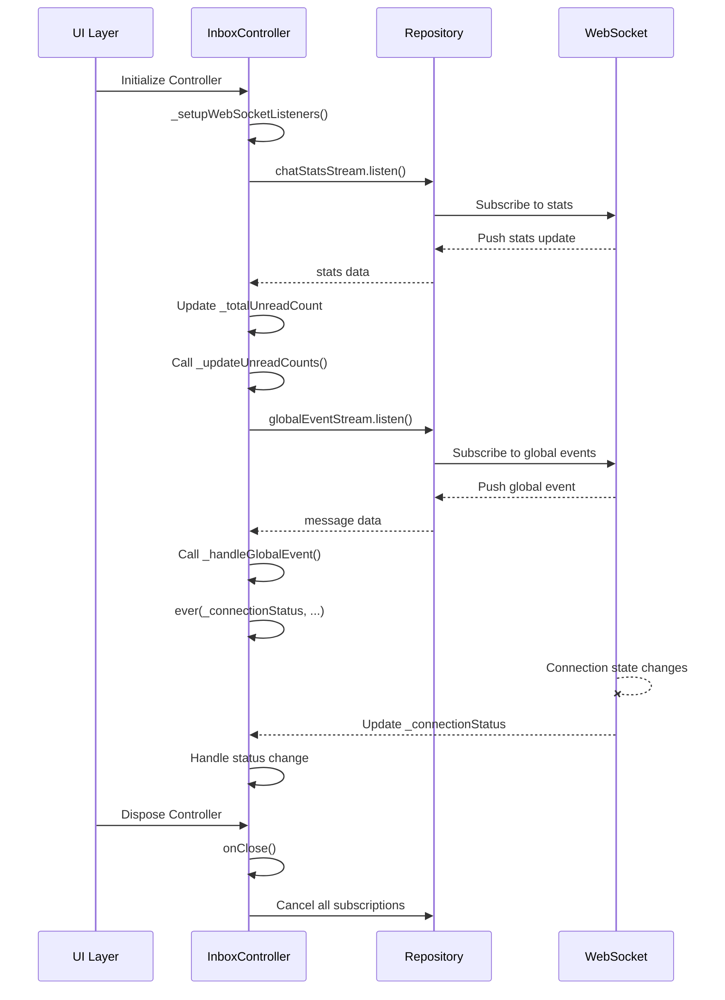

# InboxController Stream Documentation

## Overview
The `InboxController` manages real-time messaging through WebSocket streams. This document outlines the stream architecture and data flow.

## Stream Architecture

### 1. Chat Statistics Stream
- **Purpose**: Tracks unread message counts
- **Source**: `_repository.chatStatsStream`
- **Data Flow**:
  ```dart
  _chatStatsSubscription = _repository.chatStatsStream.listen(
    (stats) {
      _totalUnreadCount.value = stats['count'] ?? 0;
      _updateUnreadCounts({"count": stats['count'] ?? 0});
    },
    onError: (error) {
      if (kDebugMode) {
        print('InboxController: Chat stats error: $error');
      }
    },
  );
  ```

### 2. Global Events Stream
- **Purpose**: Handles user presence, new messages, and other global events
- **Source**: `_repository.globalEventStream`
- **Data Flow**:
  ```dart
  _globalEventSubscription = _repository.globalEventStream.listen(
    (message) => _handleGlobalEvent(message),
    onError: (error) {
      if (kDebugMode) {
        print('InboxController: Global event error: $error');
      }
    },
  );
  ```

### 3. Connection Status Monitor
- **Purpose**: Tracks WebSocket connection state
- **Source**: `_connectionStatus` (Rx variable)
- **Data Flow**:
  ```dart
  ever(_connectionStatus, (status) {
    if (status == WebSocketStatus.connected) {
      _clearError();
    } else if (status == WebSocketStatus.error) {
      _handleError('Connection lost. Attempting to reconnect...');
    }
  });
  ```

## Lifecycle Management

### Initialization
Streams are initialized in `_setupWebSocketListeners()`, which is called during controller initialization.

### Cleanup
All stream subscriptions are properly disposed in `onClose()`:
```dart
@override
void onClose() {
  _chatStatsSubscription?.cancel();
  _chatStatsSubscription = null;
  
  _globalEventSubscription?.cancel();
  _globalEventSubscription = null;
  
  super.onClose();
}
```

## Error Handling
- Each stream has dedicated error handling
- Errors are logged in debug mode
- Connection errors trigger reconnection logic
- Error states are propagated to the UI through `_handleError()`

## Best Practices
1. Always cancel subscriptions in `onClose()`
2. Use proper error handling for all streams
3. Keep stream transformations minimal in controllers
4. Use strong typing where possible
5. Document stream behavior and expected data formats

## Sequence Diagram



## Common Issues and Solutions

### Memory Leaks
- **Issue**: Subscriptions not cancelled can cause memory leaks
- **Solution**: Always implement `onClose()` and cancel all subscriptions

### Multiple Subscriptions
- **Issue**: Multiple listeners causing duplicate updates
- **Solution**: Use `.singleSubscription()` or ensure single subscription pattern

### Connection Drops
- **Issue**: WebSocket connection drops not handled
- **Solution**: Implement reconnection logic in the WebSocket service

## Related Components
- `WebSocketService`: Handles low-level WebSocket connections
- `MessagingRepository`: Manages data flow between controller and WebSocket service
- `ChatRoomModel`: Data model for chat rooms and messages
